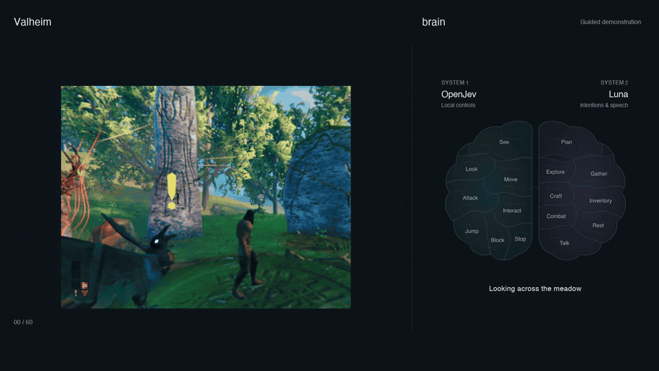
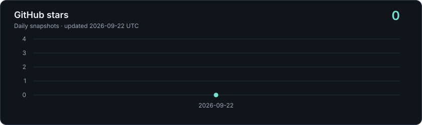

# Valheim AI · Luna + OpenJev

[](LICENSE)
[](docs/TUTORIAL.md)
[](docs/INSTALL.md)
[](docs/ARCHITECTURE.md)
[](#star-history)

A local Valheim player with two cooperating systems: **Luna** chooses goals and
dialogue; **OpenJev 0.8B** reads the game image on Apple Silicon and guides short
actions. A live brain observer shows what each system is doing.

## Watch it

[](docs/media/brain-showcase.mp4)

[Watch the one-minute video](docs/media/brain-showcase.mp4).

This is a **guided demonstration of real actions**, not autonomous performance.
Move lights up from measured movement; Talk lights up after successful chat delivery.

## Install

Supported target: **Apple Silicon Mac, official native Steam Valheim 1.0.15
(build 25390630)**. The game plugin uses the x86_64 loader through Rosetta; local
OpenJev uses native arm64 Python 3.12. Setup checks the game assembly hashes
before installing the adapter.

1. Install Steam/Valheim, native Python 3.12, and Codex with access to `gpt-5.6-luna`.
2. Download or clone this repository and keep it in a permanent folder.
3. Double-click **[`setup.command`](setup.command)** and choose **Prepare dependencies and build**.
4. Follow the **[installation and first-play tutorial](docs/TUTORIAL.md)** to verify
   normal play, install the loader/bridge, and bind your character and world.

Terminal equivalent, from the repository folder:

```sh
./setup.command prepare
```

Preparation downloads the pinned model and loader, installs a local .NET SDK,
builds against your game, and creates private settings. It does not launch Valheim
or modify its files. The tutorial covers the separate installation steps.
Run `./setup.command check` for a local installation checklist, or add `--dry-run`
to preview a setup step. Existing settings and memories are preserved.

## Play and observe

Once setup is complete, keep Steam signed in, open `scripts/launch-game.command`,
select your character and join your world manually. Then:

```sh
./scripts/observe.sh                 # Keep running in a separate terminal
./scripts/start.sh --seconds 600     # Ten minutes of autonomous play
```

Open the [brain observer](http://127.0.0.1:8733) beside the game. Switch focus back
to Valheim within 30 seconds of starting. **Keep Valheim focused**: clicking the
observer, another app, or using movement/camera controls pauses the agent.
To stop immediately, press **F8** in-game or run:

```sh
./scripts/stop.sh
```

Runs last 1–1,800 seconds, defaulting to 600. The controller releases inputs on
exit; a safety pause requires a new operator start. `--shadow --seconds 30`
observes without sending controls or chat. The brain page is a live view, and
private journals record each run.

## What is available

| Component | Behavior |
|---|---|
| System 2 · Luna, low reasoning | Chooses bounded goals, plans, inventory/crafting sequences and in-character chat |
| System 1 · local OpenJev 0.8B | Classifies the rendered view; local control logic steers, looks, interacts and stops |
| Brain observer | Shows actual planner/control events, measured movement and sent speech |
| Game bridge | Own-player status, camera, normal controls, inventory slots and known recipes; short input leases |
| Memory and personality | World-scoped SQLite memory; editable character profile; curious, talkative default character |

Inventory controls operate on the character's own grid and visible recipes.
Combat is off on fresh installs. Remote player identities are unauthenticated,
so privileged remote commands are blocked; use the local operator controls.

The bridge, memory, and observer stay on this Mac. Luna receives game images and
dialogue through your Codex account when autonomous play starts and uses that
account's model allowance. OpenJev runs locally. Server passwords are entered only
in Valheim; none are needed by the installer or stored in the repository.

## Documentation

- [Tutorial: installation to first play](docs/TUTORIAL.md)
- [Installation reference, paths and uninstall](docs/INSTALL.md)
- [Troubleshooting](docs/TROUBLESHOOTING.md)
- [Architecture: Luna, OpenJev and the observer](docs/ARCHITECTURE.md)
- [Recording your own showcase](docs/RECORDING.md)
- [Game adapter](docs/ADAPTER.md) and [sources and versions](docs/PROVENANCE.md)

## Star history



## Research and rights notice

This is an independent, unofficial research mod for studying AI agents and game
interaction. It is not affiliated with, endorsed by, or supported by Iron Gate AB,
Coffee Stain Publishing AB, Valve, or the providers of its AI models and tools.

All rights in Valheim, its name, trademarks, game content and assets belong to
Iron Gate AB, Coffee Stain Publishing AB and their respective licensors and
rights holders. All such rights are reserved. Other names, trademarks, software
and models belong to their respective owners. No ownership of those materials
is claimed, including the game visuals in the demonstration video.

Original project code is provided under the [MIT License](LICENSE); third-party
components retain their own licenses. That license grants no rights to Valheim
or other third-party content. Use requires a legitimately obtained copy of the
game and compliance with the applicable [Valheim terms](https://www.valheimgame.com/eula/),
[modding policy](https://www.valheimgame.com/news/regarding-mods/), platform terms,
model licenses and server rules. Describing this project as research does not
grant permission or an exemption from those terms.
