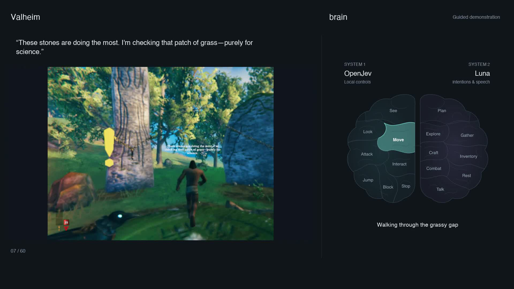

# From download to your first autonomous session

This tutorial installs the research mod on an Apple Silicon Mac and shows how
to start and observe a session.

[](media/brain-showcase.mp4)

[Play the one-minute guided demonstration](media/brain-showcase.mp4). The character
performs real movement and chat; the brain highlights match recorded events.
The demonstration is directed. Your autonomous session uses Luna and OpenJev to
choose what happens.

## 1. Get the prerequisites

You need the official native Steam Valheim installation, an Apple Silicon Mac,
Rosetta for the x86_64 game loader, native Python 3.12, and a signed-in Codex runtime
with access to `gpt-5.6-luna`.

The reviewed game is **Valheim 1.0.15 / build 25390630**. Setup checks the actual
assembly hashes. A newer/different build needs an adapter review before use.

For Python, use the [Python.org macOS installer](https://www.python.org/downloads/macos/)
for Python 3.12, or, if you already use Homebrew:

```sh
brew install python@3.12
```

This is the [official Homebrew formula](https://formulae.brew.sh/formula/python@3.12).
Use a native Terminal rather than a Terminal configured to open using Rosetta.
Keep several GB of disk space available for the 1.7 GB model, SDK, and dependencies.

Install/sign in to Codex using the [official CLI guide](https://learn.chatgpt.com/docs/codex/cli).
If `codex` is already available in Terminal, check your existing login with
`codex login status`. The launchers also find the executable bundled with the
ChatGPT/Codex macOS apps. Model access depends on your account; setup cannot grant
access or bypass usage limits. Do not put credentials in the repository.

## 2. Prepare the repository

Download the repository ZIP and extract it, or clone it. Keep the folder somewhere
permanent. Open `setup.command` in Finder and choose **1 — Prepare dependencies and
build**. If macOS blocks opening it, review the source and use the Terminal command
below; do not disable Gatekeeper or remove quarantine recursively.

Alternatively, open Terminal, type `cd `, drag the repository folder into the
Terminal window, press Return, then run:

```sh
./setup.command prepare
```

If a ZIP extraction did not preserve executable permissions, restore them with
`chmod +x setup.command scripts/*.sh scripts/*.command scripts/valheim-codex`.

Preparation detects the game, checks compatibility, verifies/stages BepInEx,
downloads the local OpenJev model, builds the bridge and creates private settings.
It does not install into the game or launch it. Existing character settings and
memories are retained. The first run can take several minutes; a failed step can
be rerun after resolving the printed error.

If your game is on another disk or Python is not found:

```sh
./setup.command prepare --game-dir '/Volumes/Games/steamapps/common/Valheim' \
  --python '/opt/homebrew/bin/python3.12'
```

The game path is remembered for later launches. You can inspect the plan without
changing files using `./setup.command prepare --dry-run`.

## 3. Verify the normal game, then install the loader

Launch the unmodified game from Steam. Create or select the character you want the
bot to use, join your world/server manually, and verify that normal play works.
Accept any required game agreement yourself. Enter server passwords in Valheim.
**Quit Valheim completely**, then choose setup step 2 or run:

```sh
./setup.command loader --normal-play-verified
```

This backs up existing destination files and installs the pinned BepInEx pack.
It refuses to write while Valheim is running. If BepInEx is already installed,
the assistant leaves it alone; see the [installation reference](INSTALL.md).

Keep Steam running and signed in. Open **`scripts/launch-game.command`** in Finder.
This is the modded launcher; the ordinary Steam Play button is not configured by
this project. If macOS asks to install Rosetta, complete the normal Apple prompt.
Do not launch a second copy of Valheim.

After reaching the menu, open `<Valheim>/BepInEx/LogOutput.log` and look for
`Chainloader startup complete`. Quit Valheim again.

## 4. Install the bridge and bind your character

Choose setup step 3, or run:

```sh
./setup.command bridge --normal-play-verified
```

This checks the BepInEx startup log, rebuilds against the reviewed assemblies,
and installs only the two bridge DLLs with a backup. Open the modded launcher
again, select the intended character and join your world. Controls start paused.

In Terminal, choose setup step 4 or run:

```sh
./setup.command player
```

Confirm the printed character and world are correct, then answer `y`. The world
identifier is observed from the client; you do not need to configure the server.
The character's display name in game must match the bound identity.

Quit Valheim, run `./scripts/valheim-codex shutdown` if the gateway is running,
then reopen the modded launcher and rejoin. This loads the new identity in both
the plugin and gateway. A connection-refused message from shutdown simply means
the gateway was not running.

Run `./setup.command check`. Every local installation item should say `OK`.
This confirms files and configuration, not model access or live game behavior.

## 5. Watch your first short session

In one Terminal window, start the observer:

```sh
./scripts/observe.sh
```

Open **[127.0.0.1:8733](http://127.0.0.1:8733)** in your browser. Place it beside
the visible game before you start. The page will be offline until a controller
publishes events. In a second Terminal window, run:

```sh
./scripts/start.sh --seconds 120
```

**Immediately click back into Valheim and leave it focused.** The controller waits
up to 30 seconds for focus, warms OpenJev while controls are paused, then starts
Luna and resumes. The two-minute limit starts after warm-up. A first model load
may take time; watch Terminal output for the active-session message.

The character chooses its own goals and dialogue. On the brain:

| Region | What the highlight means |
|---|---|
| See | OpenJev returned a perception result |
| Move | The character's measured speed indicates movement |
| Look / Attack / Interact / Jump / Block | A corresponding control was accepted |
| Plan | Luna is planning or returned a plan |
| Explore / Gather / Craft / Inventory / Combat / Rest | Planner intentions or inventory operations |
| Talk | An in-game chat send succeeded |

An intention highlight is not proof of completed crafting or combat. The diagram
shows controller events, not measurements of a neural network's internal activity.

Keep your hands off movement/camera inputs while the bot is active. Clicking the
browser, using another app, F8, or manual takeover pauses it. To take over, press
**F8**. You can also stop from Terminal:

```sh
./scripts/stop.sh
```

The time limit also stops the run and releases controls. To resume after reviewing
a pause, explicitly start another session and refocus the game. It does not resume
by itself. For a view-only check, use `./scripts/start.sh --shadow --seconds 30`;
that keeps controls paused and sends no chat.

## 6. Adjust personality and review progress

Private files are in `~/Library/Application Support/ValheimCodex/`:

- Edit `character.md` for personality, speaking style and personal goals. The default
  is curious, talkative, friendly, sometimes sarcastic, and stays in-world.
- `settings.json` contains the bound identity, chat settings and model choice.
  Combat defaults to `false`. Restart both the game and
  gateway after settings changes. Do not change the identity just to suppress an error.
- Each `playtests/<timestamp>/` folder records images, status, decisions and a final
  `summary.json` / `dual-summary.json`. Use these to distinguish actual movement
  from intentions. Logs may contain private gameplay/dialogue; do not commit them.

The game and local model share GPU capacity. To reduce GPU demand, adjust the
game's frame cap, 3D render limit and effects. These are manual game settings;
setup does not change them. The compact perception profile uses smaller images:

```sh
VALHEIM_SYSTEM_ONE_IMAGE_PROFILE=compact ./scripts/start.sh --seconds 600
```

See [troubleshooting](TROUBLESHOOTING.md) for setup and runtime issues, or use
[the recording guide](RECORDING.md) to make your own side-by-side video.
